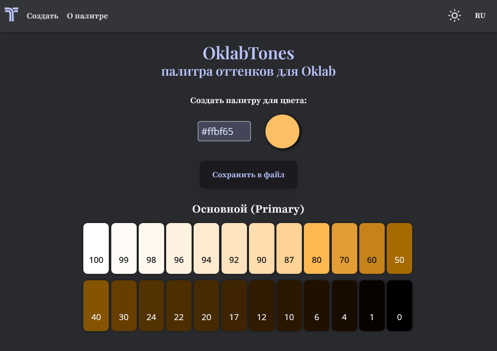

# Пет-проект: "OklabTones" (версия для деплоя на render.com)

## 1. Описание

Цель данного проекта - сформировать палитру для Материального Дизайна 3 для цветового пространства Oklab. Цвета выгружаются в формате Oklch, который позволяет легче изменить цвет на цвет, согласующийся с исходным. Например, поменять только тон (Hue) без изменения светлоты и хроматичности.

Выбор цвета (Color Picker) сформирован на основе "[react-colorful](https://www.npmjs.com/package/react-colorful)".

Деплой: [https://oklabtones.onrender.com](https://oklabtones.onrender.com)

## 2. Стек технологий

## 3. Установка и запуск приложения в локальном репозитории

1. `https://github.com/alexpar-wd/oklab-tones-deploy.git` - клонировать репозиторий (HTTPS) на локальный компьютер
2. `pnpm i` или `npm i` - установить зависимости
4. `pnpm dev` или `npm dev` - запустить в режиме разработки
5. В браузере перейти по ссылке `http://localhost:8080/`

## 4. Процесс создания

- Реализация API с функционалом:
    - преобразование цвета в разные цветовые пространства
    - формирование палитры
    - сохранение цветов палитры в файл

- Создание интерфейса:
    - отображение палитры (оттеночных рядов)
    - добавление интерактивных элементов:
        - поле ввода цвета
        - кнопка для сохранения палитры в файл
        - Color Picker [react-colorful](https://www.npmjs.com/package/react-colorful) c настройкой его отображения
        - смена тем (светлая и темная)
        - переключение языков с использованием [react-i18next](https://www.npmjs.com/package/react-i18next)
        - копирование цвета оттенка в буфер обмена
    - подключение использования [Redux Toolkit](https://www.npmjs.com/package/@reduxjs/toolkit) для сохранения состояний
    - адаптивная верстка для компьютера и мобильного устройства (брейкпоинт **768px**)
    - добавление гамбургер-меню для мобильного устройства
    - верстка страницы "О палитре"
    - переход между страницами с помощью [React Router](https://www.npmjs.com/package/react-router-dom)

## 5. Функционал

- Двухстраничный адаптивный интерфейс

- Выбор цвета с использованием Color Picker
- Нажатие `<>` в Color Picker изменяет формат отображения цвета: RGB, Oklch или смешанный формат (тон IPT, хроматичность CAM16, светлота Lab)
- Сохранение цветов палитры в файл CSS на локальном диске
- Копирование цвета оттенка в буфер обмена по нажатию на оттенок
- Переключение языков (русский и английский)
- Переключение тем (темная / светлая)
- Гамбургер-меню для мобильной версии сайта

## 6. Планируемые доработки

- Отобразить примеры интерфейсов с применением палитры

- Добавить FAB для выбора цвета
- Реализовать формирование палитры для цветового охвата Display-P3
- Добавить возможность выбора:
    - подписи для оттенков: оттенок, тон IPT, хроматичность CAM16.
    - формата цвета для сохранения
    - списка оттенков для формирования палитры
    - отображения палитры в оттенках серового (для проверки светлоты)
    - параметров формирования палитры
- Создать кнопку для сохранения экземпляров цвета (Swatches) в Color Picker
- Cоставить документацию для API
- Перевести код для API на Typescript
